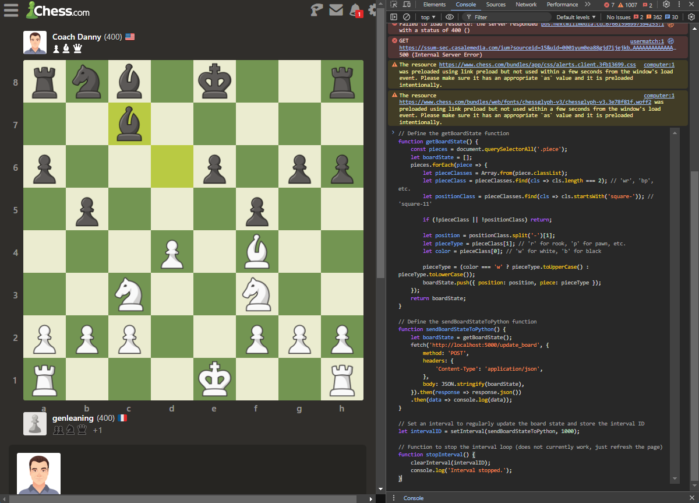
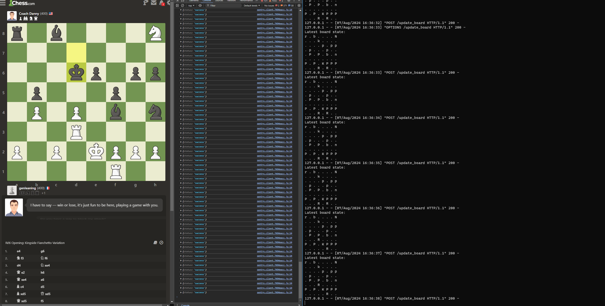

# Live board state update for Chess.com

This project provides a Flask-based server to predict chess moves using a pre-trained TensorFlow model or simply display the live board state without predictions. The server can be interacted with via a simple JavaScript client.

## Features
- Update and display the current chess board state.
- Predict the next best move using a pre-trained TensorFlow model (optional).
- Easy integration with a web client using JavaScript.

## Setup

### Prerequisites
- Python =< 3.11
- Flask
- TensorFlow
- NumPy
- python-chess

### Installation

1. **Clone the repository:**
   ```sh
   git clone https://github.com/yourusername/chess-prediction-server.git
   cd chess-prediction-server
   ```

2. **Create a virtual environment:**
   ```sh
   python -m venv venv
   source venv/bin/activate  # On Windows: venv\Scripts\activate
   ```

3. **Install the required packages:**
   ```sh
   pip install flask flask-cors python-chess numpy tensorflow
   ```

4. **Place the model and move encoder files:**
   - Ensure that `hikaru_chess_model_v2.h5` and `move_encoder_classes_v2.npy` are in the 'model/' directory of the project.

### Running the Server

You can run the server in two modes: 
- **Default mode:** Only updates the live board state without predictions, for your own projects.
- **Prediction mode:** Uses a pre-trained TensorFlow model to predict the next best move.

#### Default Mode

```sh
python app.py default
```

#### Prediction Mode

```sh
python app.py prediction
```

The server will start running at `http://localhost:5000`.

## Using the JavaScript Client

To interact with the Flask server, you can use the provided JavaScript code. We recommend using Google Chrome and the F12 web console for testing and debugging.

### JavaScript Code

Place the following JavaScript code in your web page:

```javascript
// Define the getBoardState function
function getBoardState() {
    const pieces = document.querySelectorAll('.piece');
    let boardState = [];
    pieces.forEach(piece => {
        let pieceClasses = Array.from(piece.classList);
        let pieceClass = pieceClasses.find(cls => cls.length === 2); // 'wr', 'bp', etc.
        let positionClass = pieceClasses.find(cls => cls.startsWith('square-')); // 'square-11'

        if (!pieceClass || !positionClass) return;

        let position = positionClass.split('-')[1];
        let pieceType = pieceClass[1]; // 'r' for rook, 'p' for pawn, etc.
        let color = pieceClass[0]; // 'w' for white, 'b' for black

        pieceType = (color === 'w' ? pieceType.toUpperCase() : pieceType.toLowerCase());
        boardState.push({ position: position, piece: pieceType });
    });
    return boardState;
}

// Define the sendBoardStateToPython function
function sendBoardStateToPython() {
    let boardState = getBoardState();
    fetch('http://localhost:5000/update_board', {
        method: 'POST',
        headers: {
            'Content-Type': 'application/json',
        },
        body: JSON.stringify(boardState),
    }).then(response => response.json())
    .then(data => console.log(data));
}

// Set an interval to regularly update the board state and store the interval ID
let intervalID = setInterval(sendBoardStateToPython, 1000);

// Function to stop the interval loop (does not currently work, just refresh the page)
function stopInterval() {
    clearInterval(intervalID);
    console.log('Interval stopped.');
}
```

### Testing the Client

1. Open your web page in Google Chrome.
2. Press `F12` to open the web console.
3. Ensure that the chess board on your web page has the correct class names for pieces and squares.
4. The script will send the board state to the Flask server every second and log the server's response.

## Images

- **JavaScript set up:**
  

- **Server Running:**
  

## License

This project is licensed under the MIT License - see the [LICENSE](LICENSE) file for details.
